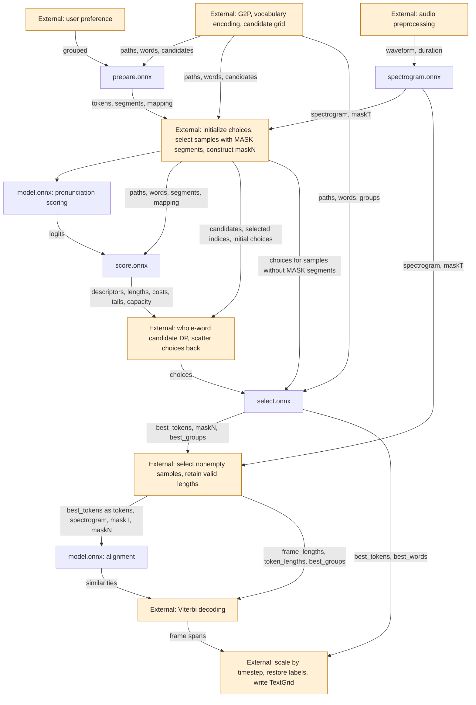

# ONNX Inference Pipeline and Interface

## Overview

Both `model.onnx` calls use the same model. Orange nodes require host implementations.



Reference implementations: [select_scored_paths](inference/scoring.py) for whole-word candidate DP and [decode_alignment_flat](modules/decoding.py) for Viterbi decoding.

## Configurations

`config.json` specifies audio timing and output dimensions:

```json5
{
    "samplerate": 48000, // Audio sample rate, Hz.
    "timestep": 0.01,   // Seconds per frame.
    "hop_size": 480,    // STFT hop size, samples.
    "fft_size": 2048,   // FFT size, samples.
    "win_size": 2048,   // Window size, samples.
    "num_mels": 80,     // Spectrogram output channels.
    "vocab_size": 256   // Token classifier output channels.
}
```

`vocabulary.json` uses the format `{"symbols": {"language/phone": id}}`. Look up the original symbol first, then `language/symbol`; multiple symbols may share an ID. Reserved IDs: PAD=0, MASK=1, SPACE=2.

## Modules and functions

| Name | Function | Inputs | Outputs |
|:--|:--|:--|:--|
| `spectrogram.onnx` | Extract log-mel features and frame masks | waveform, duration | spectrogram, maskT |
| `model.onnx` | Compute frame/token similarities and token classification logits | spectrogram, tokens, maskT, maskN | similarities, logits |
| `prepare.onnx` | Construct pronunciation scoring templates | paths, words, candidates, grouped | tokens, segments, mapping |
| `score.onnx` | Compute log-probability costs for candidate fragments and SPACE suffixes | logits, paths, words, segments, mapping | descriptors, lengths, costs, tails, capacity |
| `select.onnx` | Select complete pronunciations by choices, remove gaps, and renumber groups | paths, words, groups, choices | best_tokens, best_words, best_groups, maskN |

The host initializes `choices = any(candidates, axis=-1).astype(int64)`. Only samples with `any(segments[b,:] > 0)` enter pronunciation scoring; whole-word candidate DP fills their choices. Samples with zero valid audio frames or tokens skip model calls. Pronunciation choices must apply to whole words; fragments cannot be selected independently.

Known phone sequences use one word with one candidate and a separate group ID for each phone.

## Dimensions

| Name | Type | Meaning |
|:--|:--|:--|
| B | dynamic | Batch size of the current call |
| L | dynamic | Audio sample count after right padding |
| T | dynamic | Spectrogram frames: `floor((L + win_size - fft_size) / hop_size)`; `floor(L / hop_size)` when win_size=fft_size |
| N | dynamic | Model input token capacity; N=P for scoring calls |
| P | dynamic | Candidate grid rows; prepare and select preserve this capacity with trailing zeros |
| P1 | dynamic | P+1. Index 0 is a sentinel on fragment and segment axes, but a valid start on offset axes |
| W | dynamic | Word capacity |
| C | dynamic | Complete pronunciation candidate capacity per word |
| M | static | config.num_mels |
| V | static | config.vocab_size; not the vocabulary entry count |

All tensor dimensions must be positive. Spectrogram inputs must satisfy `L > ceil((win_size-hop_size)/2)` and T>=1. Masks represent valid lengths without changing output capacities.

## Variables

| Name | Type | dtype | shape | Convention |
|:--|:--|:--|:--|:--|
| waveform | in | float32 | [B,L] | Mono audio at the specified sample rate, padded with zeros on the right |
| duration | in | float32 | [B] | Actual duration before padding, in seconds |
| spectrogram | mid | float32 | [B,T,M] | log-mel |
| maskT | mid | bool | [B,T] | `t < round(duration/timestep)`; rounding uses ties-to-even |
| tokens | mid | int64 | [B,N] or [B,P] | Phone IDs; 0 for trailing padding, 1 for MASK in scoring templates |
| maskN | mid | bool | [B,N] or [B,P] | `tokens != 0`; select returns `best_tokens != 0` |
| similarities | mid | float32 | [B,T,N] | Frame/token cosine similarities for Viterbi decoding |
| logits | mid | float32 | [B,N,V] | Unnormalized token classification outputs; N=P when passed to score |
| paths | in | int64 | [B,P,C] | Each column preserves a complete candidate's identity within a word; 0 for alignment gaps or padding |
| words | in | int64 | [B,P] | Word IDs w+1; 0 for padding |
| candidates | in | bool | [B,W,C] | Valid candidates form a prefix; an all-zero path with true denotes a valid empty candidate; an all-false row denotes an absent word |
| grouped | in | bool | scalar | false: mask only divergent parts; true: mask entire ambiguous words |
| groups | in | int64 | [B,P,C] | Consecutive group IDs within each candidate; 0 for gaps |
| segments | mid | int64 | [B,P] | IDs of contiguous MASK runs in the scoring template; 0 elsewhere |
| mapping | mid | int64 | [B,P] | Segment IDs for divergent rows of the original grid; 0 elsewhere |
| choices | in | int64 | [B,W] | 1-based candidate IDs selected by the host: c+1 selects column c; 0 for absent words |
| descriptors | mid | int64 | [B,P1,2] | (word ID, segment ID) per fragment; 0 marks invalid entries |
| lengths | mid | int64 | [B,P1,C] | Nonzero token count per fragment and candidate |
| costs | mid | float32 | [B,P1,C,P1] | Sum of log-probabilities per fragment, candidate, and starting offset; -inf when the fragment does not fit |
| tails | mid | float32 | [B,P1,P1] | Sum of SPACE log-probabilities from the given offset to the end of each segment |
| capacity | mid | int64 | [B,P1] | MASK slot count per segment |
| best_tokens | mid | int64 | [B,P] | Selected phone IDs after compaction; 0 for padding. Passed to model as tokens |
| best_words | mid | int64 | [B,P] | Word IDs after compaction; 0 for padding |
| best_groups | mid | int64 | [B,P] | Globally consecutive group IDs after compaction; 0 for padding. Gaps between phones in the same group are disallowed |
| frame_lengths / token_lengths | mid | int64 | [B] | Host counts of maskT / maskN passed to external Viterbi decoding |

## Tifa application of dataset-tools

[Tifa](https://github.com/openvpi/dataset-tools) is a host implementation of the pipeline above with a graphical interface, written in C++ with ONNX Runtime. It aligns one waveform against the text file next to it and writes a Praat TextGrid with `words`, `phones` and `texts` tiers. Its `util` folder follows this document for every host box of the flowchart, including the whole-word candidate DP of [select_scored_paths](inference/scoring.py) and the Viterbi decoding of [decode_alignment_flat](modules/decoding.py).

### Build a package

```bash
python deploy_dataset_tools.py -m [model-path] -o [save-dir]
```

The command exports the five ONNX graphs, `config.json` and `vocabulary.json` with [deploy_model](deployment/api.py) and copies the G2P resources beside them:

```
[save-dir]/
├── model/
│   └── Tifa/                     # config.json, vocabulary.json and five *.onnx
└── dict/                         # G2P dictionaries
    ├── ds-zh-pinyin-lite.txt
    ├── jyutping_dict.txt
    ├── japanese_dict_full.txt
    ├── ds_cmudict-07b.txt
    └── LstmG2p-Eng/              # only when assets/LstmG2p-Eng exists
```

Copy `model/Tifa` to `<dataset-tools>/bin/model/Tifa` and the files of `dict` into `<dataset-tools>/bin/dict`. That folder is created by the build of the application and already contains the `mandarin` and `cantonese` folders of cpp-pinyin; the application reads the dictionaries from `<app_dir>/dict` unless another folder is selected in the window.

### Front end

The host has no MeCab and therefore no Japanese morphological analysis. Kana is converted with the shared `japanese_dict_full.txt`, while a kanji reading is reported as unsupported instead of being aligned with wrong phonemes. Mandarin and Cantonese use cpp-pinyin with `ds-zh-pinyin-lite.txt` and `jyutping_dict.txt`, as in the Python pipeline. English uses `ds_cmudict-07b.txt` and falls back to `LstmG2p-Eng` when it is present.

### Options

| Window option | Pipeline equivalent |
|:--|:--|
| Language | Language filtering of the G2P converters |
| Unknown phonemes: fail the file | `oov_handling=raise`; the file is reported as failed |
| Unknown phonemes: drop the pronunciation | `oov_handling=force`; the pronunciation is removed and the rest of the text is aligned |
| Skipped tokens | TextGrid policy for tokens that Viterbi decoding left without a frame: fail the file, omit them, or preserve them as a zero-length interval |
| Skip penalty | `skip_penalty` of [decode_alignment_flat](modules/decoding.py), default 0.5 |
